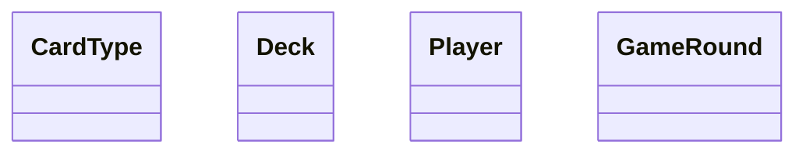

# Love Letter – Java Learning Project

Dieses Projekt dient dazu, meine Java-Kenntnisse zu vertiefen.
Als Grundlage wird das Kartenspiel **Love Letter** für 2–4 Spieler verwendet.

## Lernziele

* Objektorientierte Programmierung mit Java
* Aufbau eines modularen Datenmodells
* Client-Server-Kommunikation über TCP
* Nebenläufigkeit und asynchrone Kommunikation
* Entwicklung einer Benutzeroberfläche mit JavaFX
* Trennung von Model, View und ViewModel (MVVM)
* Versionsverwaltung mit Git und GitHub
* Schreiben von automatisierten Tests

## Aktueller Milestone

* [ ] Java und IntelliJ IDEA einrichten
* [ ] Git-Repository einrichten
* [ ] Grundlegendes Datenmodell entwerfen
* [ ] UML-Klassendiagramm erstellen
* [ ] TCP-Server implementieren
* [ ] TCP-Client implementieren
* [ ] Anmeldung mit eindeutigem Nicknamen ermöglichen
* [ ] Chatnachrichten an alle Clients übertragen
* [ ] Verbindungsaufbau und Verbindungsende bekannt geben
* [ ] Verbindung mit dem Befehl `bye` beenden
* [ ] JavaFX-Oberfläche erstellen
* [ ] Asynchronen Nachrichtenempfang umsetzen

## Anforderungen an den Chat

* Mehrere Clients können sich mit dem Server verbinden.
* Jeder Client verwendet einen eindeutigen Nicknamen.
* Neue Benutzer erhalten eine Willkommensnachricht.
* Andere Benutzer werden über Beitritt und Verlassen informiert.
* Nachrichten werden an alle verbundenen Clients übertragen.
* Mit `bye` wird die Verbindung beendet.

## Geplante Projektstruktur

```text
src/
├── main/
│   ├── java/
│   │   └── loveletter/
│   │       ├── client/
│   │       ├── server/
│   │       ├── model/
│   │       ├── view/
│   │       └── viewmodel/
│   └── resources/
└── test/
    └── java/
```

## Verwendete Technologien

* Java 22
* JavaFX 22
* TCP-Sockets
* Git und GitHub
* IntelliJ IDEA
* Maven oder Gradle

## Aktuelles Datenmodell



