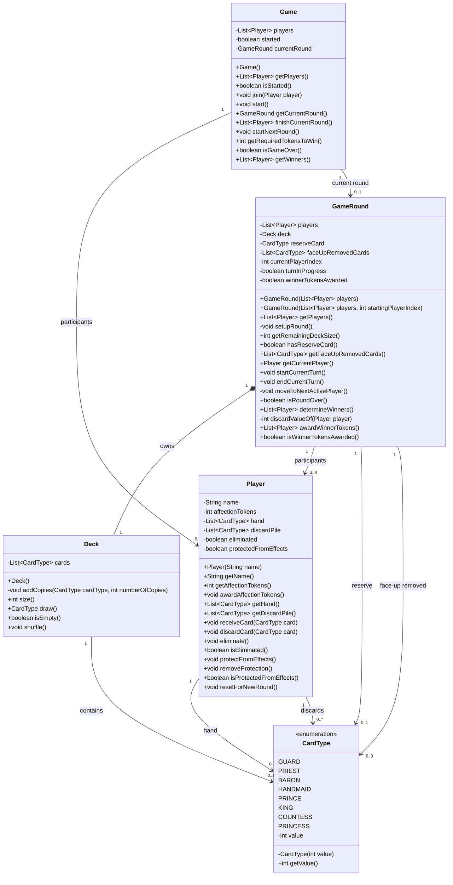

# Love Letter – Java Learning Project

Dieses Projekt dient dazu, meine Java-Kenntnisse zu vertiefen.
Als Grundlage wird das Kartenspiel **Love Letter** für 2–4 Spieler verwendet.

## Lernziele

* Objektorientierte Programmierung mit Java
* Aufbau eines modularen Datenmodells
* Client-Server-Kommunikation über TCP
* Nebenläufigkeit und asynchrone Kommunikation
* Entwicklung einer Benutzeroberfläche mit JavaFX
* Trennung von Model, View und ViewModel (MVVM)
* Versionsverwaltung mit Git und GitHub
* Schreiben von automatisierten Tests

## Milestone I – Grundlagen und TCP-Chat

* [x] Java und IntelliJ IDEA einrichten
* [x] Git-Repository einrichten
* [x] Grundlegendes Datenmodell entwerfen
* [x] UML-Klassendiagramm erstellen
* [x] TCP-Server implementieren
* [x] TCP-Client implementieren
* [x] Anmeldung mit eindeutigem Nicknamen ermöglichen
* [x] Chatnachrichten an alle Clients übertragen
* [x] Verbindungsaufbau und Verbindungsende bekannt geben
* [x] Verbindung mit dem Befehl `bye` beenden
* [x] Asynchronen Nachrichtenempfang umsetzen

## Milestone II – Spiellogik

- [x] Spiel erzeugen und Teilnehmer verwalten
- [x] Spiel mit 2–4 Spielern starten
- [x] Runden auswerten und Herzmarker vergeben
- [x] Folgerunden mit unverändertem Markerstand starten
- [x] Gesamtsieger anhand der Herzmarker ermitteln
- [ ] Karteneffekte implementieren
- [ ] Spielsteuerung über Chatbefehle integrieren
- [ ] Direktnachrichten unterstützen
- [ ] Eigene Karten privat und Spielereignisse öffentlich übertragen
- [ ] Score-Befehl und verständliche Fehlerantworten ergänzen
- [ ] Javadoc-Dokumentation vervollständigen und im Repository ablegen

## Milestone III – JavaFX-Oberfläche (optional)

- [ ] Eigene Handkarten anzeigen
- [ ] Karten durch Anklicken spielen
- [ ] Zielspieler und gegebenenfalls Kartentyp auswählen
- [ ] Aktuellen Spieler, ausgeschiedene Spieler und Punktestand anzeigen
- [ ] Oberfläche nach MVVM strukturieren
- 
### Aktuelle Vereinfachung
Bei mehreren Rundengewinnern beginnt vorläufig der erste Gewinner
in der Teilnehmerreihenfolge die nächste Runde.

### Tests

Aktuell laufen 62 automatisierte Tests erfolgreich.

## Anforderungen an den Chat

* Mehrere Clients können sich mit dem Server verbinden.
* Jeder Client verwendet einen eindeutigen Nicknamen.
* Neue Benutzer erhalten eine Willkommensnachricht.
* Andere Benutzer werden über Beitritt und Verlassen informiert.
* Nachrichten werden an alle verbundenen Clients übertragen.
* Mit `bye` wird die Verbindung beendet.

## Geplante Projektstruktur

```text
src/
├── main/
│   ├── java/
│   │   └── loveletter/
│   │       ├── client/
│   │       ├── server/
│   │       ├── model/
│   │       ├── view/
│   │       └── viewmodel/
│   └── resources/
└── test/
    └── java/
```

## Verwendete Technologien

* Java 22
* JavaFX 22
* TCP-Sockets
* Git und GitHub
* IntelliJ IDEA
* Maven

## Aktuelles Datenmodell



