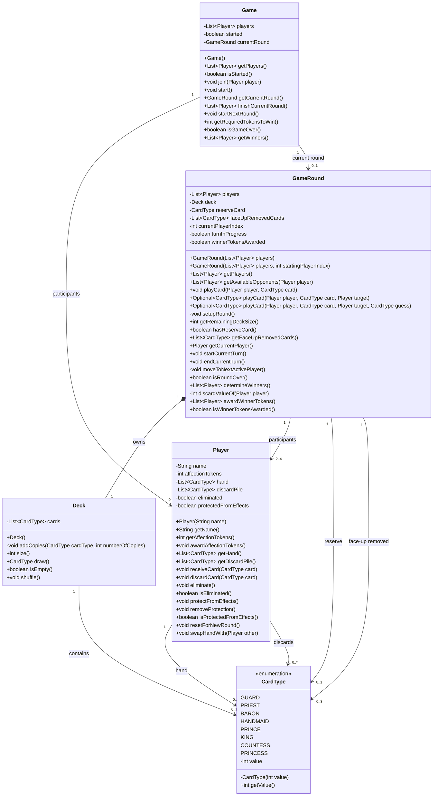

# Love Letter – Java Learning Project

Dieses Projekt dient dazu, meine Java-Kenntnisse zu vertiefen.
Als Grundlage wird das Kartenspiel **Love Letter** für 2–4 Spieler verwendet.

## Lernziele

* Objektorientierte Programmierung mit Java
* Aufbau eines modularen Datenmodells
* Client-Server-Kommunikation über TCP
* Nebenläufigkeit und asynchrone Kommunikation
* Entwicklung einer Benutzeroberfläche mit JavaFX
* Trennung von Model, View und ViewModel (MVVM)
* Versionsverwaltung mit Git und GitHub
* Schreiben von automatisierten Tests

## Milestone I – Grundlagen und TCP-Chat

* [x] Java und IntelliJ IDEA einrichten
* [x] Git-Repository einrichten
* [x] Grundlegendes Datenmodell entwerfen
* [x] UML-Klassendiagramm erstellen
* [x] TCP-Server implementieren
* [x] TCP-Client implementieren
* [x] Anmeldung mit eindeutigem Nicknamen ermöglichen
* [x] Chatnachrichten an alle Clients übertragen
* [x] Verbindungsaufbau und Verbindungsende bekannt geben
* [x] Verbindung mit dem Befehl `bye` beenden
* [x] Asynchronen Nachrichtenempfang umsetzen

## Milestone II – Spiellogik

- [x] Spiel erzeugen und Teilnehmer verwalten
- [x] Spiel mit 2–4 Spielern starten
- [x] Runden auswerten und Herzmarker vergeben
- [x] Folgerunden mit unverändertem Markerstand starten
- [x] Gesamtsieger anhand der Herzmarker ermitteln
- [x] Alle acht Karteneffekte im Datenmodell implementieren
- [x] Spielsteuerung über Chatbefehle integrieren
- [x] Direktnachrichten unterstützen
- [x] Eigene Karten privat und Spielereignisse öffentlich übertragen
- [x] Score-Befehl und verständliche Fehlerantworten ergänzen
- [x] Javadoc-Dokumentation vervollständigen und im Repository ablegen

## Milestone III – JavaFX-Oberfläche (optional)

- [ ] Eigene Handkarten anzeigen
- [ ] Karten durch Anklicken spielen
- [ ] Zielspieler und gegebenenfalls Kartentyp auswählen
- [ ] Aktuellen Spieler, ausgeschiedene Spieler und Punktestand anzeigen
- [ ] Oberfläche nach MVVM strukturieren


## Aktuelle Vereinfachung

Bei mehreren Rundengewinnern beginnt vorläufig der erste Gewinner
in der Teilnehmerreihenfolge die nächste Runde.

Wenn ein Spielteilnehmer die Verbindung verlässt, wird das bestehende
Spiel geschlossen. Der bisherige Punktestand wird nicht übernommen.
Die übrigen Clients bleiben im Chat und können mit `/create` ein neues
Spiel erstellen und mit `/join` erneut beitreten.

Verlässt nur ein Zuschauer die Verbindung, bleibt das Spiel bestehen.

## Tests

Aktuell laufen 125 automatisierte Tests erfolgreich.
Davon prüfen 37 Tests die Serverbefehle.

Die Tests prüfen unter anderem:

* Spiel- und Rundenverwaltung sowie alle acht Karteneffekte
* Ungültige Spielzüge, Schutz, Gleichstände und Reservekarten
* Verarbeitung von Spielbefehlen und verständliche Fehlerantworten
* Private Handkartenmeldungen und öffentliche Spielereignisse
* Zugwechsel, Rundenwertung, Punktevergabe und Gesamtsieg
* Verhalten beim Verlassen eines Spielteilnehmers oder Zuschauers
* Private Nachrichten, ungültige Empfänger und Nachrichten an sich selbst

Der Maven-Durchlauf mit `clean verify javadoc:javadoc` war erfolgreich.
Alle Tests bestanden; die Javadoc-Erzeugung meldete keine Warnungen.

## Javadoc-Dokumentation

Die Javadoc-Kommentare beschreiben das Datenmodell sowie Server und Client,
einschließlich wichtiger Voraussetzungen, Rückgabewerte und Fehlerfälle.

### Dokumentation öffnen

Eine generierte HTML-Version liegt unter `docs/javadoc`.
Nach dem Klonen oder Herunterladen des Projekts kann
`docs/javadoc/index.html` lokal im Browser geöffnet werden.

Die HTML-Version zeigt standardmäßig öffentliche und geschützte Elemente.
Weitere interne Methoden sind direkt im Quellcode dokumentiert.

### Dokumentation erzeugen

Mit installiertem Maven im Projektverzeichnis ausführen:

```bash
mvn clean verify javadoc:javadoc
```

Alternativ in IntelliJ über „Execute Maven Goal“ diese Ziele ausführen:

```text
clean verify javadoc:javadoc
```

Dieser Durchlauf prüft das Projekt einschließlich der Tests und erzeugt
anschließend die Dokumentation unter `target/reports/apidocs`.

### Gespeicherte HTML-Version aktualisieren

Nach Änderungen an den Javadoc-Kommentaren:

1. Die Dokumentation erneut erzeugen.
2. Den bisherigen Inhalt von `docs/javadoc` vollständig durch den Inhalt
   von `target/reports/apidocs` ersetzen.
3. `docs/javadoc/index.html` im Browser öffnen und die Darstellung prüfen.
4. Die geänderten Quelldateien und die aktualisierte HTML-Version gemeinsam committen.

Der Ordner `target` wird bei `clean` gelöscht. Die Kopie unter
`docs/javadoc` bleibt erhalten und wird mit Git versioniert.


## Spielbefehle

| Befehl | Bedeutung |
|---|---|
| `/help` | Hilfe anzeigen |
| `/msg RECIPIENT MESSAGE` | Eine private Nachricht senden |
| `/create` | Ein neues Spiel erstellen |
| `/join` | Dem Spiel beitreten |
| `/start` | Das Spiel mit mindestens zwei Teilnehmern starten |
| `/hand` | Die eigenen Handkarten privat anzeigen |
| `/score` | Den Punktestand anzeigen |
| `/play CARD [TARGET]` | Eine Karte spielen, gegebenenfalls mit Zielspieler |
| `/play GUARD TARGET GUESS` | GUARD spielen und eine Karte vermuten |
| `/next` | Nach einer gewerteten Runde die nächste Runde starten |
| `bye` | Die Verbindung beenden |

Beispiele:

- `/play HANDMAID`
- `/play PRIEST nati`
- `/play GUARD nati KING`

Nach dem Gesamtsieg ist `/next` gesperrt.

Private Nachrichten sind auch ohne Spielteilnahme möglich.

Beispiel: `/msg nati Hallo Nati!`

Nur der Empfänger erhält die Nachricht; der Absender bekommt eine
Sendebestätigung. Nachrichten an sich selbst werden einmal angezeigt.
Unbekannte oder nicht mehr verbundene Empfänger werden abgelehnt.

Die aktuelle `/msg`-Syntax unterstützt Empfängernamen ohne Leerzeichen.

## Anforderungen an den Chat

* Mehrere Clients können sich mit dem Server verbinden.
* Jeder Client verwendet einen eindeutigen Nicknamen.
* Neue Benutzer erhalten eine Willkommensnachricht.
* Andere Benutzer werden über Beitritt und Verlassen informiert.
* Nachrichten werden an alle verbundenen Clients übertragen.
* Mit `bye` wird die Verbindung beendet.

## Geplante Projektstruktur

```text
src/
├── main/
│   ├── java/
│   │   └── loveletter/
│   │       ├── client/
│   │       ├── server/
│   │       ├── model/
│   │       ├── view/
│   │       └── viewmodel/
│   └── resources/
└── test/
    └── java/
```

## Verwendete Technologien

* Java 22
* JavaFX 22
* TCP-Sockets
* Git und GitHub
* IntelliJ IDEA
* Maven

## Aktuelles Datenmodell



