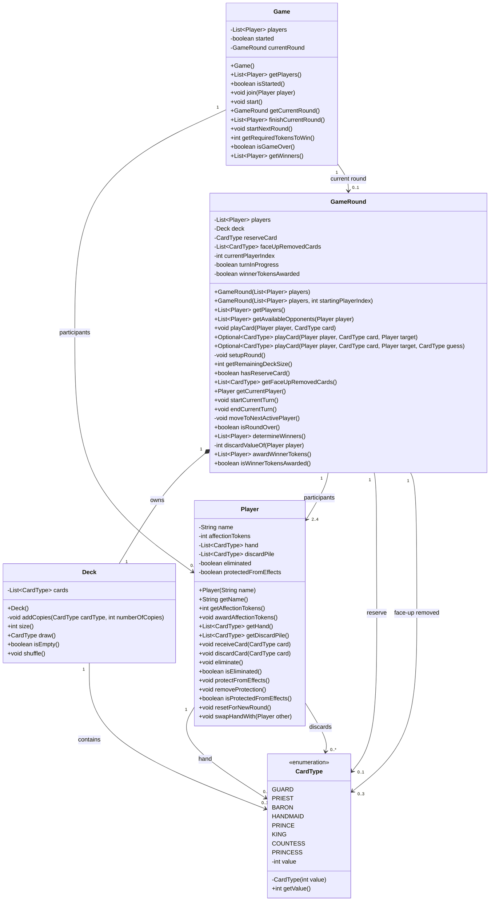
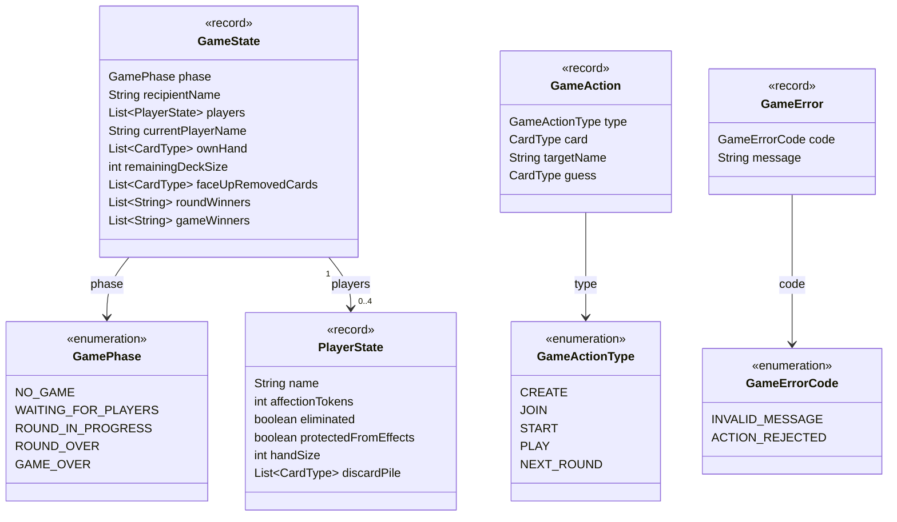

# Love Letter – Java Learning Project

Dieses Projekt dient dazu, meine Java-Kenntnisse zu vertiefen.
Als Grundlage wird das Kartenspiel **Love Letter** für 2–4 Spieler verwendet.

## Lernziele

* Objektorientierte Programmierung mit Java
* Aufbau eines modularen Datenmodells
* Client-Server-Kommunikation über TCP
* Nebenläufigkeit und asynchrone Kommunikation
* Entwicklung einer Benutzeroberfläche mit JavaFX
* Trennung von Model, View und ViewModel (MVVM)
* Versionsverwaltung mit Git und GitHub
* Schreiben von automatisierten Tests

## Milestone I – Grundlagen und TCP-Chat

* [x] Java und IntelliJ IDEA einrichten
* [x] Git-Repository einrichten
* [x] Grundlegendes Datenmodell entwerfen
* [x] UML-Klassendiagramm erstellen
* [x] TCP-Server implementieren
* [x] TCP-Client implementieren
* [x] Anmeldung mit eindeutigem Nicknamen ermöglichen
* [x] Chatnachrichten an alle Clients übertragen
* [x] Verbindungsaufbau und Verbindungsende bekannt geben
* [x] Verbindung mit dem Befehl `bye` beenden
* [x] Asynchronen Nachrichtenempfang umsetzen

## Milestone II – Spiellogik

- [x] Spiel erzeugen und Teilnehmer verwalten
- [x] Spiel mit 2–4 Spielern starten
- [x] Runden auswerten und Herzmarker vergeben
- [x] Folgerunden mit unverändertem Markerstand starten
- [x] Gesamtsieger anhand der Herzmarker ermitteln
- [x] Alle acht Karteneffekte im Datenmodell implementieren
- [x] Spielsteuerung über Chatbefehle integrieren
- [x] Direktnachrichten unterstützen
- [x] Eigene Karten privat und Spielereignisse öffentlich übertragen
- [x] Score-Befehl und verständliche Fehlerantworten ergänzen
- [x] Javadoc-Dokumentation vervollständigen und im Repository ablegen

## Milestone III – JavaFX-Oberfläche

* [x] JavaFX einrichten und ein Anwendungsfenster erstellen
* [x] Anmeldeformular in View und ViewModel aufteilen
* [x] Asynchrone Serververbindung und Nickname-Anmeldung integrieren
* [x] Vergebene Nicknamen und Verbindungsfehler anzeigen
* [x] Verbindung beim Schließen des Fensters beenden
* [x] Spielzustand zwischen Server und Oberfläche synchronisieren
* [x] Eigene Handkarten anzeigen
* [x] Karten durch Anklicken spielen
* [x] Zielspieler und gegebenenfalls Kartentyp auswählen
* [x] Aktuellen Spieler, ausgeschiedene Spieler und Punktestand anzeigen
* [ ] MVVM-Struktur auf die Spieloberfläche erweitern
* [x] Strukturierte Nachrichten für Spielzustände, Aktionen und Fehler integrieren
* [x] Strukturierte Serverfehler anzeigen, ohne die Verbindung zu beenden


## Aktuelle Vereinfachung

Bei mehreren Rundengewinnern beginnt vorläufig der erste Gewinner
in der Teilnehmerreihenfolge die nächste Runde.

Wenn ein Spielteilnehmer die Verbindung verlässt, wird das bestehende
Spiel geschlossen. Der bisherige Punktestand wird nicht übernommen.
Die übrigen Clients bleiben im Chat und können mit `/create` ein neues
Spiel erstellen und mit `/join` erneut beitreten.

Verlässt nur ein Zuschauer die Verbindung, bleibt das Spiel bestehen.

## Tests

Aktuell laufen 153 automatisierte Tests erfolgreich.
Davon entfallen 56 Tests auf ChatServerTest, 4 auf GameStateCodecTest,
4 auf GameActionCodecTest und 1 auf GameErrorCodecTest.
Die übrigen 88 Tests prüfen das Datenmodell.

Die Tests prüfen unter anderem:

* Spiel- und Rundenverwaltung sowie alle acht Karteneffekte
* Ungültige Spielzüge, Schutz, Gleichstände und Reservekarten
* Verarbeitung von Spielbefehlen und verständliche Fehlerantworten
* Private Handkartenmeldungen und öffentliche Spielereignisse
* Zugwechsel, Rundenwertung, Punktevergabe und Gesamtsieg
* Verhalten beim Verlassen eines Spielteilnehmers oder Zuschauers
* Private Nachrichten, ungültige Empfänger und Nachrichten an sich selbst
* Serialisierung und Deserialisierung strukturierter Protokollnachrichten
* Strukturierte Fehler bei ungültigen Nachrichten und abgelehnten Aktionen
* Unveränderte Spielzustände nach abgelehnten Aktionen
* Private Priester-Aufdeckungen ohne Weitergabe an andere Spieler oder Zuschauer


Der Maven-Durchlauf mit `clean verify javadoc:javadoc` war erfolgreich.
Alle Tests bestanden; die Javadoc-Erzeugung meldete keine Warnungen.

### Manuelle Prüfung der JavaFX-Anmeldung

Folgende Fälle wurden manuell geprüft:

* [x] Erfolgreiche Anmeldung mit freiem Nicknamen
* [x] Ablehnung eines bereits vergebenen Nicknamens
* [x] Erfolgreicher erneuter Versuch mit einem anderen Namen
* [x] Fehlermeldung bei nicht gestartetem Server
* [x] Anzeige einer Verbindungstrennung und erneute Freigabe des Formulars
* [x] Trennung des Clients beim Schließen des Fensters


Diese Prüfungen ergänzen die automatisierten Tests. Sie sind nicht in
der oben genannten Testanzahl enthalten.

### Manuelle Prüfung der JavaFX-Spieloberfläche

Folgende Fälle wurden manuell geprüft:

* [x] Spiel erstellen, beitreten und starten
* [x] Eigene Handkarten mit Namen und Werten anzeigen
* [x] Karte durch Anklicken auswählen und ausspielen
* [x] Auswahl abbrechen und dabei Ziel- und Rateauswahl zurücksetzen
* [x] Zielspieler und bei GUARD einen Kartentyp auswählen
* [x] Private Karteninformation durch PRIEST anzeigen
* [x] Strukturierte GAME_ERROR-Meldungen anzeigen, Handkarten behalten und
  einen zweiten Spielversuch über dieselbe Verbindung senden
* [x] BARON ohne verfügbaren Gegner ausspielen
* [x] GUARD ohne verfügbaren Gegner und ohne Ratekarte ausspielen
* [x] Ziel- und Rateauswahl bei GUARD ohne verfügbaren Gegner deaktivieren
* [x] Nächste Runde über die Oberfläche starten
* [ ] Gräfin-Regel gezielt in der JavaFX-Oberfläche prüfen
* [x] Teilnehmer anzeigen und den eigenen Spieler markieren
* [x] Aktuellen Spieler, Schutzstatus und ausgeschiedene Spieler anzeigen
* [x] Herzmarker anzeigen und beim Rundenwechsel beibehalten
* [x] Rundengewinner und Gesamtsieger getrennt anzeigen
* [x] Spielerübersicht zwischen zwei JavaFX-Clients synchronisieren,
  während jeder Client nur seine eigenen Handkarten anzeigt
* [x] Bedienelemente bei kleinen Fenstern durch Scrollen erreichbar halten

Diese manuellen Prüfungen sind nicht in der Anzahl der automatisierten
Tests enthalten.

## Javadoc-Dokumentation

Die Javadoc-Kommentare beschreiben das Datenmodell sowie Server und Client,
einschließlich wichtiger Voraussetzungen, Rückgabewerte und Fehlerfälle.

### Dokumentation öffnen

Eine generierte HTML-Version liegt unter `docs/javadoc`.
Nach dem Klonen oder Herunterladen des Projekts kann
`docs/javadoc/index.html` lokal im Browser geöffnet werden.

Die HTML-Version zeigt standardmäßig öffentliche und geschützte Elemente.
Weitere interne Methoden sind direkt im Quellcode dokumentiert.

### Dokumentation erzeugen

Mit installiertem Maven im Projektverzeichnis ausführen:

```bash
mvn clean verify javadoc:javadoc
```

Alternativ in IntelliJ über „Execute Maven Goal“ diese Ziele ausführen:

```text
clean verify javadoc:javadoc
```

Dieser Durchlauf prüft das Projekt einschließlich der Tests und erzeugt
anschließend die Dokumentation unter `target/reports/apidocs`.

### Gespeicherte HTML-Version aktualisieren

Nach Änderungen an den Javadoc-Kommentaren:

1. Die Dokumentation erneut erzeugen.
2. Den bisherigen Inhalt von `docs/javadoc` vollständig durch den Inhalt
   von `target/reports/apidocs` ersetzen.
3. `docs/javadoc/index.html` im Browser öffnen und die Darstellung prüfen.
4. Die geänderten Quelldateien und die aktualisierte HTML-Version gemeinsam committen.

Der Ordner `target` wird bei `clean` gelöscht. Die Kopie unter
`docs/javadoc` bleibt erhalten und wird mit Git versioniert.

## Anwendung starten

### Voraussetzungen

* JDK 22
* Maven oder die Maven-Integration von IntelliJ IDEA

JavaFX 22.0.2 wird über Maven eingebunden. Ein separater Download des
JavaFX-SDKs ist nicht erforderlich.

### Server starten

In IntelliJ die `main`-Methode der Klasse
`loveletter.server.ChatServer` ausführen.

Der Server meldet:

```text
Chat server started on port 5500
```

Den Server während der Nutzung der Clients weiterlaufen lassen.

### Grafischen Client starten

In IntelliJ über „Execute Maven Goal“ ausführen:

```text
compile javafx:run
```

Alternativ mit installiertem Maven im Projektverzeichnis:

```bash
mvn compile javafx:run
```

Der grafische Client verbindet sich mit `localhost` auf Port `5500`.
Er startet den Server nicht automatisch.

Einen freien Nicknamen eingeben und auf **Connect** klicken.
Nach erfolgreicher Anmeldung erscheint eine Willkommensnachricht.
Eingabefeld und Button bleiben während der aktiven Verbindung deaktiviert.

Ist der Name bereits vergeben, kann ein anderer Name eingegeben und
ein neuer Verbindungsversuch gestartet werden. Bei einem Verbindungsfehler
oder einer Trennung durch den Server wird das Formular wieder freigegeben.

Beim Schließen des Fensters wird die Verbindung beendet.

### Aktueller Funktionsumfang der GUI

Die grafische Oberfläche unterstützt die Anmeldung sowie das Erstellen,
Beitreten und Starten eines Spiels. Eigene Handkarten werden mit Namen
und Werten angezeigt und können durch Anklicken gespielt werden.

Je nach Karte lassen sich ein Zielspieler und bei GUARD ein Kartentyp
auswählen. Wenn kein gültiger Gegner verfügbar ist, kann GUARD ohne
Ziel und Ratekarte ausgespielt werden. Die entsprechenden Auswahlfelder
sind dann deaktiviert.

Der Server überträgt persönliche Spielzustände an die Oberfläche.
Servermeldungen erscheinen als aktuelle Rückmeldung. Eine durch PRIEST
aufgedeckte Karte wird dem ausführenden Spieler separat angezeigt.
Nach dem Rundenende kann die nächste Runde über einen Button gestartet werden.

Die Spielerübersicht zeigt Teilnehmer, den eigenen Spieler, den aktuellen
Zug, Schutzstatus, ausgeschiedene Spieler und Herzmarker. Rundengewinner
und Gesamtsieger werden getrennt angezeigt. Bei kleinen Fenstern bleibt
die Oberfläche durch Scrollen bedienbar.

Eine Chatansicht mit Nachrichtenverlauf ist noch nicht umgesetzt.
Der Konsolenclient bleibt weiterhin nutzbar.

### Konsolenclient starten

Die `main`-Methode der Klasse `loveletter.client.ChatClient` ausführen.
Für mehrere Spieler mehrere Instanzen starten und unterschiedliche
Nicknamen verwenden.

Nach der Anmeldung können die unten beschriebenen Chat- und Spielbefehle
eingegeben werden.

## Spielbefehle

| Befehl | Bedeutung |
|---|---|
| `/help` | Hilfe anzeigen |
| `/msg RECIPIENT MESSAGE` | Eine private Nachricht senden |
| `/create` | Ein neues Spiel erstellen |
| `/join` | Dem Spiel beitreten |
| `/start` | Das Spiel mit mindestens zwei Teilnehmern starten |
| `/hand` | Die eigenen Handkarten privat anzeigen |
| `/score` | Den Punktestand anzeigen |
| `/subscribe-state` | Persönliche Spielzustände als GAME_STATE-Nachrichten mit JSON-Inhalt abonnieren |
| `/play CARD [TARGET]` | Eine Karte spielen, gegebenenfalls mit Zielspieler |
| `/play GUARD TARGET GUESS` | GUARD spielen und eine Karte vermuten |
| `/next` | Nach einer gewerteten Runde die nächste Runde starten |
| `bye` | Die Verbindung beenden |

Beispiele:

- `/play HANDMAID`
- `/play PRIEST nati`
- `/play GUARD nati KING`

Nach dem Gesamtsieg ist `/next` gesperrt.

Private Nachrichten sind auch ohne Spielteilnahme möglich.

Beispiel: `/msg nati Hallo Nati!`

Nur der Empfänger erhält die Nachricht; der Absender bekommt eine
Sendebestätigung. Nachrichten an sich selbst werden einmal angezeigt.
Unbekannte oder nicht mehr verbundene Empfänger werden abgelehnt.

Die aktuelle `/msg`-Syntax unterstützt Empfängernamen ohne Leerzeichen.

## Anforderungen an den Chat

* Mehrere Clients können sich mit dem Server verbinden.
* Jeder Client verwendet einen eindeutigen Nicknamen.
* Neue Benutzer erhalten eine Willkommensnachricht.
* Andere Benutzer werden über Beitritt und Verlassen informiert.
* Nachrichten werden an alle verbundenen Clients übertragen.
* Mit `bye` wird die Verbindung beendet.

## Geplante Projektstruktur

```text
src/
├── main/
│   ├── java/
│   │   └── loveletter/
│   │       ├── client/
│   │       ├── server/
│   │       ├── model/
│   │       ├── protocol/
│   │       ├── view/
│   │       └── viewmodel/
│   └── resources/
└── test/
    └── java/
```

## Verwendete Technologien

* Java 22
* JavaFX 22
* Gson zur Serialisierung und Deserialisierung von Spielzuständen,
  Spielaktionen und Fehlern als JSON
* TCP-Sockets
* Git und GitHub
* IntelliJ IDEA
* Maven

## Aktuelles Datenmodell


```mermaid
classDiagram
    class CardType {
    <<enumeration>>
    GUARD
    PRIEST
    BARON
    HANDMAID
    PRINCE
    KING
    COUNTESS
    PRINCESS
    -int value
    -CardType(int value)
    +int getValue()
}
    class Deck {
    -List~CardType~ cards
    +Deck()
    -void addCopies(CardType cardType, int numberOfCopies)
    +int size()
    +CardType draw()
    +boolean isEmpty()
    +void shuffle()
}
    class Player {
    -String name
    -int affectionTokens
    -List~CardType~ hand
    -List~CardType~ discardPile
    -boolean eliminated
    -boolean protectedFromEffects
    +Player(String name)
    +String getName()
    +int getAffectionTokens()
    +void awardAffectionTokens()
    +List~CardType~ getHand()
    +List~CardType~ getDiscardPile()
    +void receiveCard(CardType card)
    +void discardCard(CardType card)
    +void eliminate()
    +boolean isEliminated()
    +void protectFromEffects()
    +void removeProtection()
    +boolean isProtectedFromEffects()
    +void resetForNewRound()
    +void swapHandWith(Player other)
}
    class GameRound {
    -List~Player~ players
    -Deck deck
    -CardType reserveCard
    -List~CardType~ faceUpRemovedCards
    -int currentPlayerIndex
    -boolean turnInProgress
    -boolean winnerTokensAwarded
    +GameRound(List~Player~ players)
    +GameRound(List~Player~ players, int startingPlayerIndex)        
    +List~Player~ getPlayers()
    +List~Player~ getAvailableOpponents(Player player)
    +void playCard(Player player, CardType card)
    +Optional~CardType~ playCard(Player player, CardType card, Player target)
    +Optional~CardType~ playCard(Player player, CardType card, Player target, CardType guess)
    -void setupRound()
    +int getRemainingDeckSize()
    +boolean hasReserveCard()
    +List~CardType~ getFaceUpRemovedCards()
    +Player getCurrentPlayer()
    +void startCurrentTurn()
    +void endCurrentTurn()
    -void moveToNextActivePlayer()
    +boolean isRoundOver()
    +List~Player~ determineWinners()
    -int discardValueOf(Player player)
    +List~Player~ awardWinnerTokens()
    +boolean isWinnerTokensAwarded()
}
    class Game {
        -List~Player~ players
        -boolean started
        -GameRound currentRound
        +Game()
        +List~Player~ getPlayers()
        +boolean isStarted()
        +void join(Player player)
        +void start()
        +GameRound getCurrentRound()
        +List~Player~ finishCurrentRound()
        +void startNextRound()
        +int getRequiredTokensToWin()
        +boolean isGameOver()
        +List~Player~ getWinners() 
}

    GameRound "1" *-- "1" Deck : owns
    GameRound "1" --> "2..4" Player : participants
    Deck "1" --> "0..16" CardType : contains

    Player "1" --> "0..2" CardType : hand
    Player "1" --> "0..*" CardType : discards

    GameRound "1" --> "0..1" CardType : reserve
    GameRound "1" --> "0..3" CardType : face-up removed

    Game "1" --> "0..4" Player : participants
    Game "1" --> "0..1" GameRound : current round
```


## Protokollmodell

Die Protokollklassen beschreiben die Daten, die zwischen Server und
grafischem Client übertragen werden. Sie führen selbst keine Spielregeln aus.

* `GameState` enthält den Spielzustand aus Sicht eines Empfängers.
* `PlayerState` enthält öffentlich sichtbare Informationen über einen Spieler.
* `GameAction` beschreibt eine angeforderte Aktion.
* `GameError` enthält einen Fehlercode und eine verständliche Meldung.


```mermaid
classDiagram
    direction TB

    class GameState {
        <<record>>
        GamePhase phase
        String recipientName
        List~PlayerState~ players
        String currentPlayerName
        List~CardType~ ownHand
        int remainingDeckSize
        List~CardType~ faceUpRemovedCards
        List~String~ roundWinners
        List~String~ gameWinners
    }

    class PlayerState {
        <<record>>
        String name
        int affectionTokens
        boolean eliminated
        boolean protectedFromEffects
        int handSize
        List~CardType~ discardPile
    }

    class GamePhase {
        <<enumeration>>
        NO_GAME
        WAITING_FOR_PLAYERS
        ROUND_IN_PROGRESS
        ROUND_OVER
        GAME_OVER
    }

    class GameAction {
        <<record>>
        GameActionType type
        CardType card
        String targetName
        CardType guess
    }

    class GameActionType {
        <<enumeration>>
        CREATE
        JOIN
        START
        PLAY
        NEXT_ROUND
    }

    class GameError {
        <<record>>
        GameErrorCode code
        String message
    }

    class GameErrorCode {
        <<enumeration>>
        INVALID_MESSAGE
        ACTION_REJECTED
    }

    GameState --> GamePhase : phase
    GameState "1" --> "0..4" PlayerState : players
    GameAction --> GameActionType : type
    GameError --> GameErrorCode : code
```

`GameStateCodec`, `GameActionCodec` und `GameErrorCodec` wandeln
die jeweiligen Records in JSON um und lesen sie aus JSON ein.

Die Nachrichten verwenden die Präfixe `GAME_STATE`, `GAME_ACTION`
und `GAME_ERROR`, jeweils gefolgt von einem Leerzeichen und dem JSON-Inhalt.
Spielzustände und Fehler werden vom Server zum Client gesendet;
Spielaktionen werden vom grafischen Client zum Server gesendet.

Die Handkarten anderer Spieler sind nicht Bestandteil von `PlayerState`.
Jeder Empfänger erhält seine eigenen Handkarten über `GameState.ownHand`.
Private Priester-Aufdeckungen werden weiterhin separat als Textnachricht
an den berechtigten Spieler übertragen.